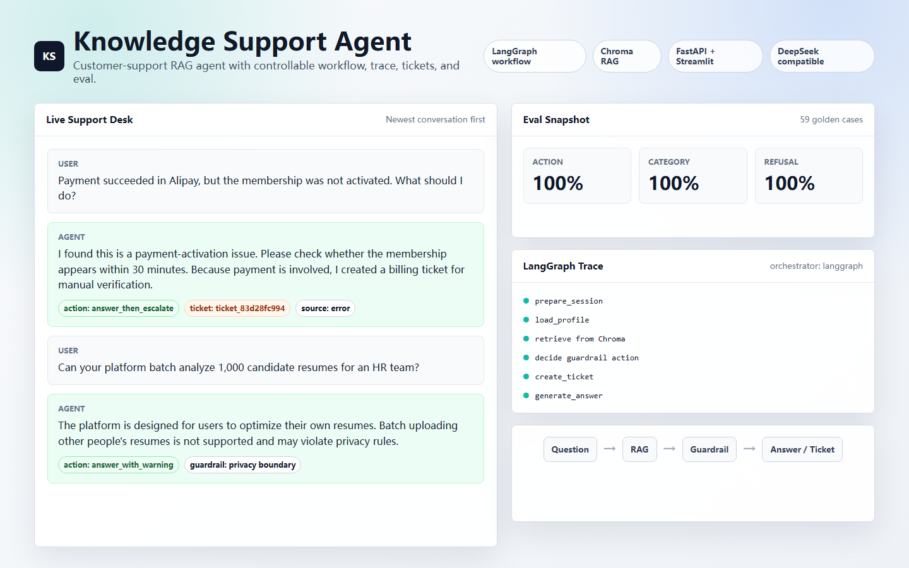
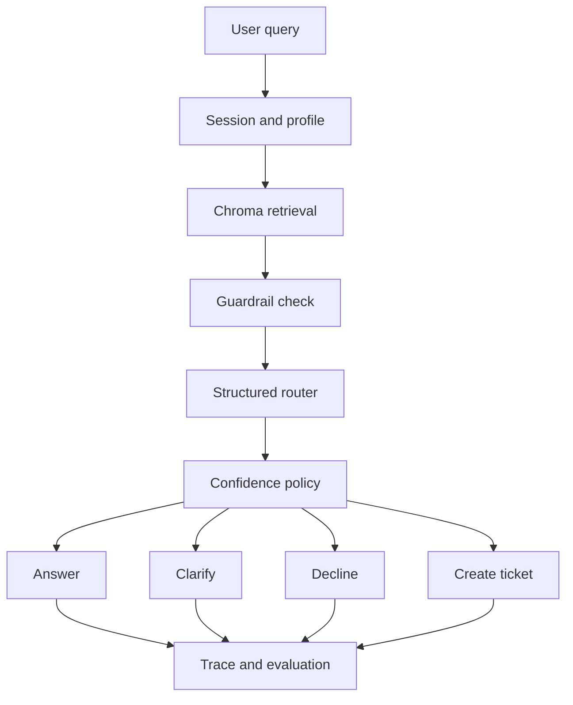

# Knowledge Support Agent

A controllable Knowledge Support Agent for an AI resume platform, built with LangGraph, Chroma RAG, guardrail-first routing, structured routing fallback, human escalation, traces, and offline evaluation.



## Architecture



The workflow is implemented as a LangGraph state machine:

```text
prepare_session
  -> load_profile
  -> retrieve
  -> guardrail_check
  -> route_intent
  -> confidence_check
  -> answer / clarify / decline / create_ticket
  -> persist_trace
```

## Core Capabilities

- LangGraph workflow with explicit nodes for session, profile, retrieval, guardrails, routing, confidence checks, response generation, ticket creation, and trace persistence.
- Chroma-backed RAG using an offline hash embedding default, with optional OpenAI-compatible embeddings.
- Guardrail-first handling for refunds, billing issues, privacy/account-security requests, human escalation, regulated advice, exaggerated success claims, and prompt injection.
- Structured router interface with Pydantic validation. In default mode it uses deterministic offline fallback, so the project runs without an OpenAI API key.
- Optional OpenAI-compatible routing and answer generation.
- SQLite session memory, trace logs, and local ticket storage.
- Offline evaluation for standard, paraphrase, adversarial, and retrieval cases.
- FastAPI API, Streamlit UI, Dockerfile, Docker Compose, tests, and GitHub Actions.

## Install And Run

```bash
git clone https://github.com/JiaoZiQ/Knowledge_Support_Agent.git
cd Knowledge_Support_Agent

python -m venv .venv
```

Windows:

```bash
.\.venv\Scripts\activate
```

macOS / Linux:

```bash
source .venv/bin/activate
```

Install dependencies and start the API:

```bash
pip install -r requirements.txt
uvicorn app.main:app --reload
```

Start the Streamlit UI in another terminal:

```bash
streamlit run ui/streamlit_app.py
```

Local URLs:

- API docs: `http://127.0.0.1:8000/docs`
- Streamlit UI: `http://127.0.0.1:8501`

## Docker Compose

```bash
docker compose up --build
```

Compose services:

- `api`: FastAPI service exposed on `8000:8000`
- `ui`: Streamlit service exposed on `8501:8501`
- The UI calls the API through `API_BASE_URL=http://api:8000`
- `./data` and `./artifacts` are mounted for Chroma, SQLite, tickets, traces, and evaluation outputs
- The UI waits for the API healthcheck before starting

Docker Compose configuration has passed static validation with `docker compose config`, but end-to-end container startup has not been fully verified because the local Docker build timed out.

## Configuration

Copy the example environment file when you want local overrides:

```bash
cp .env.example .env
```

Default offline mode:

```env
ROUTER_MODE=offline
USE_OPENAI_LLM=false
EMBEDDING_PROVIDER=hash
RETRIEVAL_MIN_SCORE=0.35
ROUTING_MIN_CONFIDENCE=0.60
```

OpenAI-compatible mode:

```env
ROUTER_MODE=openai
OPENAI_API_KEY=your_api_key
OPENAI_BASE_URL=
OPENAI_MODEL=gpt-4o-mini
USE_OPENAI_LLM=true
CHAT_MODEL=gpt-4o-mini
```

The project remains runnable without `OPENAI_API_KEY`. If the structured router is unavailable, times out, returns invalid JSON, or has low confidence, the deterministic offline fallback and confidence policy are used.

## API Example

```bash
curl -X POST http://127.0.0.1:8000/chat \
  -H "Content-Type: application/json" \
  -d '{"query":"The payment succeeded but my membership is not active","user_id":"demo_user"}'
```

Example response shape:

```json
{
  "session_id": "sess_xxx",
  "answer": "This request requires order verification. A ticket has been created...",
  "action": "create_ticket",
  "intent": "billing_issue",
  "routing_source": "guardrail",
  "ticket_id": "ticket_xxx",
  "trace_id": "trace_xxx",
  "confidence": 1.0,
  "citations": [
    {
      "id": "billing_002",
      "category": "billing",
      "title": "Payment succeeded but membership is inactive",
      "score": 1.03
    }
  ]
}
```

## Demo Scenarios

- Feature question: `What is the difference between the free and pro plans?` -> `answer`
- Vague request: `Can you help me with this?` -> `ask_clarifying_question`
- Billing/refund issue: `The payment succeeded but my membership is not active` -> `create_ticket`
- Legal, medical, or investment advice: `Can you write a legal claim for my contract dispute?` -> `decline`
- Human escalation: `I want to talk to a human support agent` -> `create_ticket`

## Evaluation

Run the offline evaluations:

```bash
python scripts/run_action_eval.py
python scripts/run_retrieval_eval.py
```

Latest local offline results:

- Action eval: 74 cases across `standard`, `paraphrase`, and `adversarial`; action accuracy `100.00%`, intent accuracy `100.00%`.
- Retrieval eval: 20 cases; Recall@1 `90.00%`, Recall@3 `90.00%`, MRR `0.9000`, no-hit rate `10.00%`.

Reports are written to:

- `artifacts/eval/action_eval_results.json`
- `artifacts/eval/action_eval_report.md`
- `artifacts/eval/retrieval_eval_results.json`
- `artifacts/eval/retrieval_eval_report.md`

These are offline regression checks over a compact project dataset, not production-wide quality guarantees.

## Tests

```bash
pytest -q
```

The test suite covers offline no-key behavior, guardrails, fallback routing, retrieval confidence policy, `/health`, `/chat`, ticket creation, prompt injection handling, and trace persistence.

## Limitations

- This is a controlled support workflow, not a fully autonomous production agent.
- The current knowledge base is intentionally compact and should be expanded before production use.
- Default routing is deterministic offline fallback logic, not real LLM reasoning.
- Hash embeddings are used by default for reproducibility, so semantic retrieval quality is limited.
- Docker Compose configuration has passed static validation, but end-to-end container startup still needs to be verified in an environment where Docker build completes.
- Production deployment still needs authentication, rate limiting, stronger PII handling, centralized monitoring, and integration with a real ticketing system.
