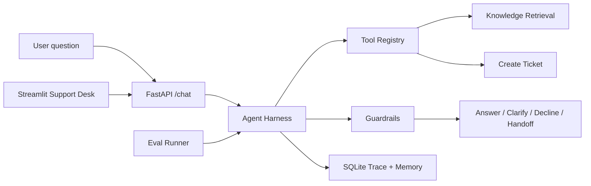

# Knowledge Support Agent

一个面向 AI 简历优化平台的知识库客服 Agent。项目重点不是普通 RAG，而是用轻量 **Agent Harness** 把检索、工具调用、风险策略、人工介入、trace、memory 和 eval 串成可演示的业务闭环。

## 功能

- 知识库检索：读取 `data/knowledge_base/raw/knowledge_base.json`，构建本地向量检索索引。
- 客服问答：根据知识库回答，并返回引用来源。
- Agent Harness：统一控制回答、免责声明、拒答、追问、创建工单。
- 工具调用：内置知识库检索、工单创建、用户画像、会话摘要工具。
- 会话记忆：保存用户历史问题和最近动作摘要。
- Trace log：记录检索结果、工具调用、风险策略、耗时和最终动作。
- Eval：使用 `data/eval/eval_dataset.json` 评估 action accuracy、category hit rate、refusal precision。
- Streamlit demo：支持客服对话、trace 查看、工单查看和一键评估。

## 架构



## 本地运行

```bash
cd F:\final_intern\knowledge_support_agent
python -m venv .venv
.\.venv\Scripts\activate
pip install -r requirements.txt
copy .env.example .env
uvicorn app.main:app --reload
```

另开一个终端运行演示界面：

```bash
cd F:\final_intern\knowledge_support_agent
.\.venv\Scripts\activate
streamlit run streamlit_app.py
```

- API: `http://127.0.0.1:8000/docs`
- Demo: `http://localhost:8501`

如果使用 OpenAI 兼容接口，在 `.env` 中设置：

```env
OPENAI_API_KEY=你的 key
OPENAI_BASE_URL=https://api.deepseek.com
CHAT_MODEL=deepseek-v4-flash
USE_OPENAI_LLM=true
```

检索默认仍使用本地 hash embedding，保证 demo 离线可跑；真实模型只负责最终客服回答生成。

## 面试讲法

一句话：我做了一个客服场景的 RAG Agent，但重点是 Agent Harness，让模型输出可控、可观测、可评估。

可展开的亮点：

- 不是裸 RAG：回答前会判断风险等级和 recommended action。
- 不是只调 API：有 tool registry、ticket workflow、memory 和 trace。
- 有人类介入：退款、重复扣费、隐私删除等高风险问题自动建工单。
- 有评估：用 golden queries 统计动作准确率、分类命中率和拒答表现。
- 可扩展：当前是本地检索，后续可以替换成 Chroma/Qdrant；当前是轻量 harness，后续可接 LangGraph/MCP。

## 简历 Bullet

- 设计并实现知识库客服 Agent，基于 FastAPI 构建轻量 Agent Harness，统一编排 RAG 检索、工具调用、风险策略、人工工单、会话记忆和 trace log。
- 构建客服评估集与 eval runner，评估 action accuracy、category hit rate、refusal precision 和平均延迟，覆盖退款、隐私、拒答、免责声明等高风险场景。
- 实现 Streamlit 演示台，支持对话问答、引用溯源、Agent 决策路径查看、工单查看和一键评估，提升项目可展示性和面试讲解效率。
