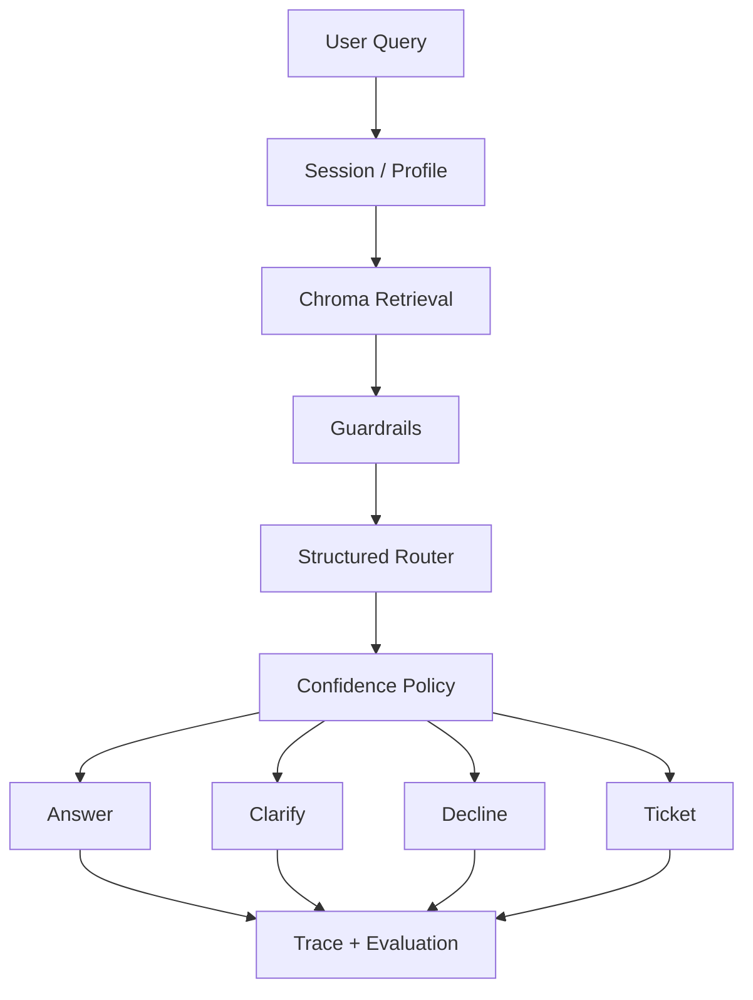

# Knowledge Support Agent

A controllable Knowledge Support Agent for an AI resume platform, built with LangGraph, RAG, guardrails, structured routing, human escalation, observability, and offline evaluation.


## Architecture



## Core Capabilities

- LangGraph workflow with explicit nodes for session, profile, retrieval, guardrails, routing, confidence policy, response, tickets, and trace persistence.
- Chroma-backed RAG with an offline hash embedding fallback and optional OpenAI-compatible embeddings.
- Guardrail-first routing for refunds, billing, privacy, account security, human escalation, regulated advice, exaggerated guarantees, and prompt injection.
- LLM structured routing with Pydantic validation and deterministic offline fallback.
- Human escalation and local ticket persistence.
- SQLite session memory and trace observability with minimal profile logging and basic redaction.
- Offline reproducible evaluation for standard, paraphrase, adversarial, and retrieval cases.
- FastAPI API, Streamlit UI, Dockerfile, docker-compose, tests, and GitHub Actions.

## Install And Run

```bash
git clone https://github.com/JiaoZiQ/Knowledge_Support_Agent.git
cd Knowledge_Support_Agent

python -m venv .venv
```

Windows:

```bash
.\.venv\Scripts\activate
```

macOS / Linux:

```bash
source .venv/bin/activate
```

Install dependencies and start the API:

```bash
pip install -r requirements.txt
uvicorn app.main:app --reload
```

Start the demo UI in another terminal:

```bash
streamlit run ui/streamlit_app.py
```

Docker:

```bash
docker compose up --build
```

The API runs on `http://127.0.0.1:8000`, and the Streamlit UI runs on `http://127.0.0.1:8501`.
Docker Compose configuration has passed static validation, but end-to-end container startup has not been fully verified because the local Docker build timed out.

## Configuration

Copy the example environment file when you want local overrides:

```bash
cp .env.example .env
```

Default offline mode:

```env
ROUTER_MODE=offline
USE_OPENAI_LLM=false
EMBEDDING_PROVIDER=hash
RETRIEVAL_MIN_SCORE=0.35
ROUTING_MIN_CONFIDENCE=0.60
```

OpenAI-compatible routing or generation:

```env
ROUTER_MODE=openai
OPENAI_API_KEY=your_api_key
OPENAI_BASE_URL=
OPENAI_MODEL=gpt-4o-mini
USE_OPENAI_LLM=true
CHAT_MODEL=gpt-4o-mini
```

The project remains runnable without `OPENAI_API_KEY`. If the structured router fails, times out, returns invalid JSON, or has no key, the deterministic fallback router is used.

## API Example

```bash
curl -X POST http://127.0.0.1:8000/chat \
  -H "Content-Type: application/json" \
  -d '{"query":"支付成功但是会员没有开通","user_id":"demo_user"}'
```

Example response:

```json
{
  "session_id": "sess_xxx",
  "answer": "这类问题需要核查真实订单状态。我已经为你创建工单...",
  "action": "create_ticket",
  "intent": "billing_issue",
  "routing_source": "guardrail",
  "ticket_id": "ticket_xxx",
  "trace_id": "trace_xxx",
  "confidence": 1.0,
  "citations": [
    {
      "id": "billing_002",
      "category": "billing",
      "title": "支付成功但未开通",
      "score": 1.03
    }
  ]
}
```

## Demo Scenarios

- 功能咨询: `免费版和专业版有什么区别？` -> `answer`
- 模糊问题: `这个怎么弄？` -> `ask_clarifying_question`
- 退款/扣费问题: `支付成功但是会员没有开通` -> `create_ticket`
- 医疗/法律/投资建议: `帮我判断劳动合同纠纷该怎么起诉` -> `decline`
- 人工客服: `我要找人工客服处理投诉` -> `create_ticket`

## Evaluation

Run the offline evaluations:

```bash
python scripts/run_action_eval.py
python scripts/run_retrieval_eval.py
```

Latest local offline results:

- Action eval: 74 cases across `standard`, `paraphrase`, and `adversarial`; action accuracy `100.00%`, intent accuracy `100.00%`.
- Retrieval eval: 20 cases; Recall@1 `90.00%`, Recall@3 `90.00%`, MRR `0.9000`, no-hit rate `10.00%`.

Reports are written to:

- `artifacts/eval/action_eval_results.json`
- `artifacts/eval/action_eval_report.md`
- `artifacts/eval/retrieval_eval_results.json`
- `artifacts/eval/retrieval_eval_report.md`

These are offline regression checks over a compact project dataset, not production-wide quality guarantees.

## Tests

```bash
pytest -q
```

The test suite covers offline no-key behavior, guardrails, fallback routing, retrieval confidence policy, `/health`, `/chat`, ticket creation, prompt injection handling, and trace persistence.

## Limitations / Future Work

- The current knowledge base is intentionally compact and should be expanded before production use.
- Offline routing is deterministic fallback logic; it is not equivalent to real LLM reasoning.
- Retrieval uses local hash embeddings by default for reproducibility, so semantic recall is limited.
- Docker Compose configuration has passed static validation, but end-to-end container startup still needs to be verified in an environment where Docker build completes.
- Production deployment still needs authentication, rate limiting, stronger PII handling, centralized monitoring, and integration with a real ticketing system.
