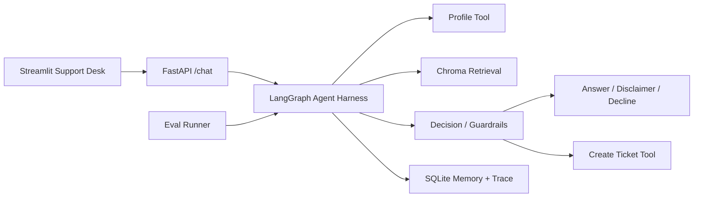

# Knowledge Support Agent

一个面向 AI 简历优化平台的知识库客服 Agent。项目重点不是普通聊天机器人，而是把 **LangGraph workflow + Chroma RAG + Tool Calling + Human Handoff + Trace + Eval** 做成一个可运行、可解释、可评估的 Agent Harness。

## 功能

- **Chroma RAG**：读取 `data/knowledge_base/raw/knowledge_base.json`，写入本地 Chroma 持久化向量库。
- **可选真实 embedding**：默认 `EMBEDDING_PROVIDER=hash` 离线可跑；支持切到 `openai` 兼容 embedding。
- **LangGraph 编排**：客服链路由 `prepare_session -> load_profile -> retrieve -> decide -> create_ticket/generate_answer -> persist_trace` 节点组成。
- **Agent Harness**：统一控制回答、免责声明、拒答、追问、创建工单和人工介入。
- **工具调用**：内置知识库检索、工单创建、用户画像、会话摘要工具。
- **会话记忆**：保存用户历史问题和最近动作摘要，支持多轮上下文。
- **Trace log**：记录检索结果、LangGraph 节点、guardrail、耗时和最终动作。
- **Eval runner**：使用 `data/eval/eval_dataset.json` 评估 action accuracy、category hit rate、refusal precision。
- **Streamlit demo**：支持对话、引用溯源、trace 查看、工单查看和一键评估。

## 架构



## 本地运行

```bash
cd F:\final_intern\knowledge_support_agent
python -m venv .venv
.\.venv\Scripts\activate
pip install -r requirements.txt
copy .env.example .env
uvicorn app.main:app --reload
```

另开一个终端运行演示界面：

```bash
cd F:\final_intern\knowledge_support_agent
.\.venv\Scripts\activate
streamlit run streamlit_app.py
```

- API: `http://127.0.0.1:8000/docs`
- Demo: `http://127.0.0.1:8501`

## 配置

`.env.example` 已包含全部必要配置：

```env
OPENAI_API_KEY=
OPENAI_BASE_URL=
CHAT_MODEL=gpt-4o-mini
EMBEDDING_MODEL=text-embedding-3-small
USE_OPENAI_LLM=false
EMBEDDING_PROVIDER=hash
DATABASE_PATH=data/app.db
CHROMA_PATH=data/chroma
CHROMA_COLLECTION=knowledge_support
```

使用 DeepSeek 等 OpenAI 兼容聊天接口时：

```env
OPENAI_API_KEY=你的 key
OPENAI_BASE_URL=https://api.deepseek.com
CHAT_MODEL=deepseek-v4-flash
USE_OPENAI_LLM=true
```

说明：DeepSeek 聊天接口可用于最终回答生成；如果你的服务不支持 embedding，请保持 `EMBEDDING_PROVIDER=hash`。如果换成支持 embeddings 的 OpenAI 兼容服务，可设置 `EMBEDDING_PROVIDER=openai`。

## 当前评估表现

离线 hash embedding + Chroma 重排的当前全量 eval：

- action accuracy: 98%+
- category hit rate: 93%+
- refusal precision: 100%

评估命令：

```bash
python -m pytest -q
```

或在 Streamlit 的 Eval 标签页一键运行。

## 面试讲法

一句话：我做了一个客服场景的 RAG Agent，但重点是 Agent Harness，让模型输出可控、可观测、可评估。

可展开的亮点：

- 不是裸 RAG：回答前会判断风险等级、业务动作和是否需要人工介入。
- 不是只调 API：有 tool registry、ticket workflow、memory、trace 和 eval。
- 有 LangGraph：用状态图表达客服流程，而不是把所有逻辑塞进一个 prompt。
- 有 Chroma：知识库被写入真实向量库，支持持久化检索。
- 有 guardrails：退款、重复扣费、隐私删除、职业承诺、法律医疗财务问题都有明确边界。
- 有评估：用 golden queries 统计动作准确率、分类命中率和拒答表现。

## 简历 Bullet

- 设计并实现知识库客服 Agent，基于 FastAPI、LangGraph 和 Chroma 构建 Agent Harness，统一编排 RAG 检索、工具调用、风险策略、人工工单、会话记忆和 trace log。
- 构建客服评估集与 eval runner，评估 action accuracy、category hit rate、refusal precision 和平均延迟，覆盖退款、隐私、拒答、免责声明等高风险场景。
- 实现 Streamlit 演示台，支持对话问答、引用溯源、LangGraph 决策路径查看、工单查看和一键评估，提升项目可展示性和面试讲解效率。
